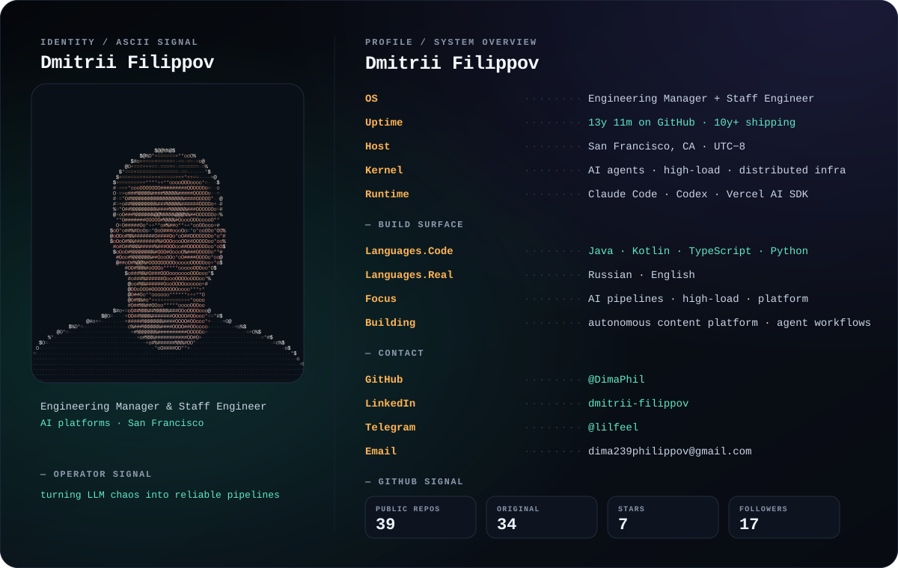

  

  <a href="https://github.com/DimaPhil">GitHub</a> ·
  <a href="https://www.linkedin.com/in/dmitrii-filippov-7557ab137/">LinkedIn</a> ·
  <a href="https://t.me/lilfeel">Telegram</a> ·
  <a href="mailto:dima239philippov@gmail.com">Email</a>

 

### Selected systems

- [`media-ingester`](https://github.com/DimaPhil/media-ingester) — asynchronously ingest & understand media (transcription, parsing) behind a REST API.
- [`mail-digester`](https://github.com/DimaPhil/mail-digester) — filter and recombine newsletters and high-volume inboxes into a clean digest UI.
- [`nutrition-tracker`](https://github.com/DimaPhil/nutrition-tracker) — track nutrition from a photo of your food.
- [`telegram-proxy-api`](https://github.com/DimaPhil/telegram-proxy-api) — your own Telegram data as a FastAPI service over MTProto.

The terminal card is generated from public data with the scripts in this repo. No private or employer information is included.
